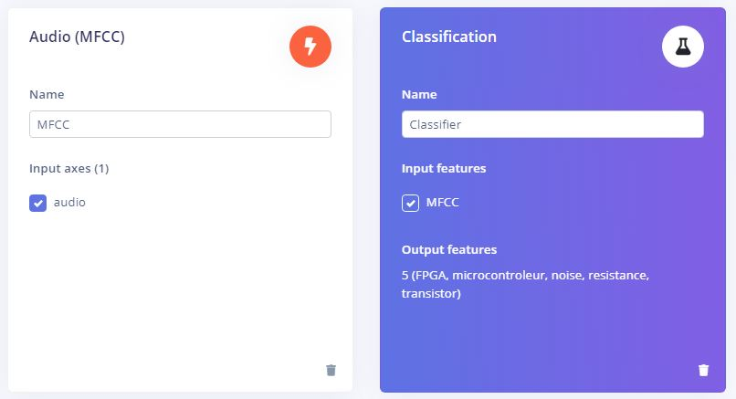

# Projet 2 "Détection et classification des sons"
###### Réalisé par : *Zaynab ROMENE*
#
Le but de ce projet est de détecter les mots suivants: " résistance" , "transistor", "FPGA"," microcontrôleur" pour faire clignoter la led graduellement à chaque fois qu’on prononce un mot particulier. Ceci est fait à l'aide d'un modèle d'intellignece artificielle qu'on va mettre en place dans ce même TP.

## 1- Matériel utilisé: 
#### 1-1- Hardware 
Nous utilisons le Kit d'apprentissage Tiny ML d'arduino pour explorer l'Embedded Machine Learning.C'est une nouvelle technologie qui active l'intelligence artificielle juste à côté du monde physique à l'aide des données récupérées par les capteurs. Ce kit comprend un Arduino Nano 33 BLE Sense. Il est basé sur le microcontrôleur nRF52840 et fonctionne sur le système d'exploitation Arm® Mbed™. Le Nano 33 BLE Sense offre non seulement la possibilité de se connecter via Bluetooth® Low Energy, mais est également équipée de capteurs pour détecter la couleur, la proximité, le mouvement, la température, l'humidité, l'audio et plus encore. Vous pouvez cliquer sur l'image ci-dessous pour plus de détails ou bien il suffit de lire [le datasheet de la carte][df4]. 

[](https://docs.arduino.cc/hardware/nano-33-ble-sense) 

Le processeur est caractérisé par : 
* 64 MHz Arm® Cortex-M4F (with FPU)
* 1 MB Flash + 256 KB RAM

Ce qui nous intéresse dans ce projet c'est le microphone. Le microphone de notre carte est le MP34DT05. Commen mentionné dans son [datasheet][df1] , le MP34DT05 permet de détecter et d'analyser le son en temps réel et peut être utilisé pour créer une interface vocale.


Le MP34DT05 est un microphone MEMS numérique omnidirectionnel ultra-compact à faible consommation avec une interface IC.
- Rapport signal/bruit : 64 dB
- Sensibilité : -26dBFS ±3dB (capable de détecter les ondes acoustiques ) 
- Plage de température : -40 à 85°C

#### 1-2- Software
Edge Impulse c'est un site qui permet de faire l'acquisition des données qui serviront à entrainer une IA. L'acquisition peut être faite à l'aide des capteurs du capteur ou bien par plusieurs autres alternatives.En proposant, une approche simplifiée de l'intelligence artificielle à l'aide des blocs, il permet d'entrainer le modèle avec la possibilité de personnaliser les paramètres. Ensuite, il fournit le code à implanter dans le microcontrôleur afin d'utiliser le réseau entrainé ous peuvent avoir plus d'informations en cliquant sur l'image suivante:
[](https://www.edgeimpulse.com/) 

Bien évidemment , on utilise l'IDE de la carte Arduino pour la programmation de la carte et pour utiliser le modèle entrainé. Vous pouvez avoir plus d'informations en cliquant sur l'image suivante:
[](https://www.arduino.cc/)

## 2- Les étapes : 
### 2-1- Collecter, traiter et tester la data 
On commence par créer un projet Edge Impulse. Pour acquérir les données, on peut utiliser plusieurs méthodes concrètement le téléphone ou bien notre carte nano 33 ble sense. On opte pour le microphone MP34DT05 de la carte. 
#### 2-1-1- Connecter la carte au compte Edge Impulse
Il faut créer un compte Edge impulse et connecter la carte en utilisant cette [ vidéo Youtube][df3] et ce [document][df2]. Ceci est fait en téléchargeant le fichier compressé de Edge Impulse sur le PC et puis la dernière version du firmware dans la carte. Une fois le "flashing" est terminé, on appuie une fois sur le bouton RESET pour lancer le nouveau firmware. On lance ensuite la commande dans le terminal :
```sh
edge-impulse-daemon
```
Ceci va nous permettre de connecter la carte directement au compte Edge Impulse en écrivant juste l'adresse et le mot de passe. Par la suite, la carte sera visible sur le tableau de bord d'Edge Impulse.

#### 2-1-2- Enregistrer les mots
Une fois la carte est connecter au tableau de bord d'e 'Edge Impulse, il devient possible d'utiliser le MP34DT05 pour enregistrer les mots " résistance" , "transistor", "FPGA"," microcontrôleur". On donne à chaque catégorie le label correspondant. 
Il s'est avéré que changer la voix ou d'enregistrer les mots à l'aide de plusieurs personnes peut aboutir à une base donnée plus performante. J'ai choisi d'enregistrer 10 mots sur 10s en fixant le **sampling length** à 10s.Puis, j'ai divisé les morceaux sur 10 pour obtenir un mot à chaque 1s d'audio. La quantité de data qui peut-être capturée d'un seul coup varie selon la carte utilisée. La mémoire de notre carte Arduino Nano 33 BLE Sense nous permet d'enregistrer 16s en un chaque essai. 
Pour rendre la base de données plus variée et plus fonctionnelle on ajoute là-dessus une autre base de données de bruit conçue spécialement  pour la détection des mots-clés. Lors de l'enregistrement des nouveaux mots, les données seront ajoutées directement à la base d'entraînement. Pour équilibrer les pourcentages de données entre la base d'entraînement et la base de test, on click sur >  `dashboard` --> `rebalacing data`
Personnellement, j'ai collecté juste 5 min de data avec environ 1 min de chaque label :  noise, résistance, FPGA, microcontrôleur, transistor.
### 2-2- Paramétrer , entraîner et télècharger le modèle 
Une fois, les données collectées, on passe au paramétrage dans la section Impulse design. Pour préparer le modèle, on ajoute: 
- un bloc de traitement " a processing bloc" : J'ai choisi MFCC bloc qui est dédié à la parole humaine. 
- un bloc d'apprentissage " a learning bloc" : J'ai choisi Classification bloc qui permet de trouver des patterns dans la data et les appliquer aux nouvelles données.



Après l'enregistrement de ces paramètres, on  vérifie le fonctionnement prévu du modèle sur la carte BLE sens autrement dit la rapidité d l'exécution du modèle sur la carte. On trouve ces informations dans la section de MFCC.
Pour notre cas, le modèle va prendre 17 kb de la mémoire et va s'exécuter dans 177ms. Ceci est négligeable puisque la carte contient 256kb de RAM. Et même l'exécution est considérée rapide. Ces résultats varient selon la quantité des données.

On génère ensuite les features de notre base de données et on visualise la data en 3D pour vérifier que les données sont bien séparées ou bien s'il y a des problèmes à corriger.

On peut détecter les problèmes de classification et les corriger en les supprimant ou bien en changeant le label. 

On passe ensuite au classifier, où on va entraîner le modèle à distinguer entre les différentes classes. J'ai laissé les paramètres par défaut.


Une fois le modèle testé et corrigé, on passe au déploiement. On télécharge le projet sous forme de bibliothèques Arduino en ajoutant ou désactivant l'optimisation.


### 2-3- Allumer La LED L graduellement
 Puis, on l'ajoute dans l'IDE et on ouvre le sketch *nano_ble33_sense_microphone_continuous* afin de tester notre modèle avant d'ajouter la partie de la LED. 
Une fois le programme fonctionne et donne les probabilités comme suit: 

En respectant l'énoncé, j'ai graduellement clignoté le LED pour un seul mot particulier " transistor" en utilisant le code suivant;
```sh
   if(result.classification[4].value > 0.7) {
      for(int i=0; i<=40; i++){
         digitalWrite(led_pin ,LOW);
         delay(i*10);
         digitalWrite(led_pin ,HIGH);
         delay(i*10);
      }
   }else {
    digitalWrite(led_pin ,LOW);  
   }
```
## 3- Résultat : 
On a clignoté la LED L  graduellement en respectant l'énoncé. On pourra, toutefois, utiliser le LED RGB qui existe sur la carte et la clignoter graduellement en utilisant une différente couleur pour chaque mot.
On a réussi alors à détecter les mots en clignotant la Led pour un mot particulier ( j'ai choisi transistor). Autrement dit, le modèle de machine Learning entrainer sur Edge Impulse fonctionne parfaitement même après l'adaptation du programme.
## Ressources :
- https://docs.arduino.cc/tutorials/nano-33-ble-sense/edge-impulse 
- https://docs.arduino.cc/tutorials/nano-33-ble-sense/microphone-sensor 
- https://www.youtube.com/watch?v=vbIg4Up1Ts0&t=1094s 
- https://docs.edgeimpulse.com/docs/tutorials/audio-classification
- https://docs.edgeimpulse.com/docs/development-platforms/officially-supported-mcu-targets/arduino-nano-33-ble-sense 
- https://www.youtube.com/watch?v=ERoQiQhJ38U 
- https://www.youtube.com/watch?v=muIe9IAI4-A
- https://www.youtube.com/watch?v=FseGCn-oBA0&list=PL7VEa1KauMQp9bQdo2jLlJCdzprWkc7zC 
- https://www.deviceplus.com/arduino/the-basics-of-arduino-adjusting-led-brightness/#:~:text=You%20can%20easily%20switch%20an,use%20the%20%E2%80%9CPWM%E2%80%9D%20output.
- https://pijaeducation.com/arduino/how-to-take-output-from-arduino-uno/led-brightness-control-using-arduino/

[df1]: https://content.arduino.cc/assets/Nano_BLE_Sense_mp34dt05-a.pdf?_gl=1*b34798*_ga*MTg0NTMwMTQ0NC4xNjcwNDMwOTEw*_ga_NEXN8H46L5*MTY3Mjk0MjIyOS45LjEuMTY3Mjk0NzQxMy4wLjAuMA..
[df2]:https://docs.edgeimpulse.com/docs/development-platforms/officially-supported-mcu-targets/arduino-nano-33-ble-sense
[df3]: https://www.youtube.com/watch?v=wOkMZUaPLUM 
[df4]: https://docs.arduino.cc/static/bdb53f29f29a67b0df0243b265617e7b/ABX00031-datasheet.pdf
